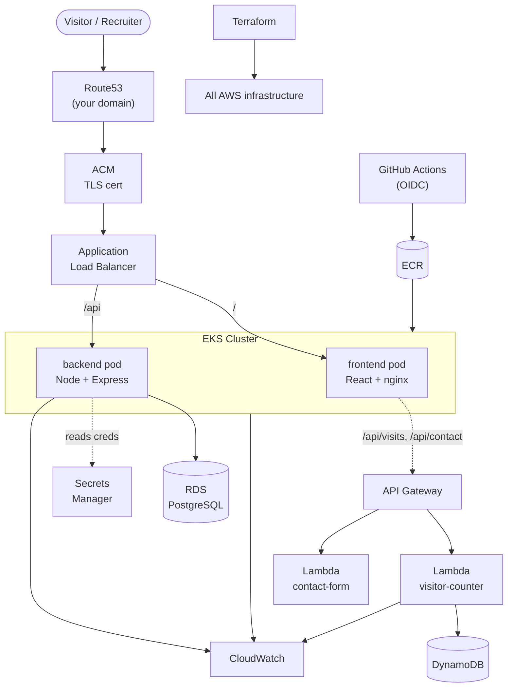

# Architecture diagram (reference)

The canonical reference diagram for this project, as a **mermaid** graph (GitHub
renders it below). This is documentation — for the diagram shown on the **live
site**, see [frontend/public/diagrams/](../../frontend/public/diagrams/) (your
draw.io diagram).

## Legend

- **Solid arrows** — request / data flow.
- **Dotted arrows** — credential reads and async calls.
- **Cylinders** — data stores (RDS, DynamoDB, ECR).

## Keeping it current

If you change the architecture (e.g. add a cache or a queue), update this
diagram **and** your draw.io diagram on the site so they match what you actually
deployed. Reviewers compare the diagram against your real infrastructure.
